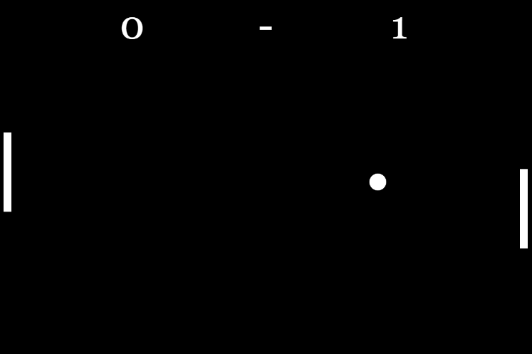

<h1>Pong Game v1.0 🕹️</h1>

<h2>Classical Atari game "Pong" made in HTML5, CSS3 and Javascript using a JavaScript library for creative coding "p5.js".</h2>

<h3>I've done this game in a way to study and improve my logic programming as well.</h3>
<h2>Technologies Used:</h3>

<table>
<tr>
<td>HTML</td>
<td>CSS</td>
<td>JavaScript</td>
</tr>
 
<h2>Repository used to collide objects: https://github.com/bmoren/p5.collide2D#colliderectcircle</h2>
<h2>If you want to play: https://editor.p5js.org/ericksilverio.10/full/02SV0zCVyB</h2>
<h2>------------------------------------------------------------------------------</h2>
<h2>Clássico jogo de Atari "Pong" feito em HTML5, CSS3 e JavaScript usando uma biblioteca de JS para código criativo "p5.js".</h2>

<h3>Fiz esse jogo de forma a estudar e melhorar a minha lógica de programação.</h3>
  
<h2>Tecnologias usadas:</h3>

<table>
<tr>
<td>HTML</td>
<td>CSS</td>
<td>JavaScript</td>
</tr>
  
 <h2>Repositório usado para fazer a colisão de objetos: https://github.com/bmoren/p5.collide2D#colliderectcircle</h2>
 <h2>Se você quiser jogar: https://editor.p5js.org/ericksilverio.10/full/02SV0zCVyB</h2>

